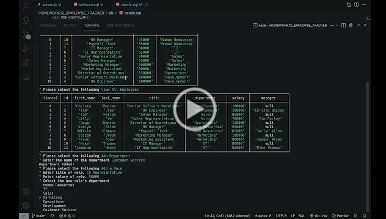

# HOMEWORK12_EMPLOYEE_TRACKER

# MySQL - Employee Tracker

## Description: 
 The purpose of this project was create a employee tracker using MySQL Database and NPM Inquirer package. This is a command line application that allow users to:
 - View a list of existing company departments, roles, and/or employees
 - Add a new departments, roles, and/or employees
 - Update an employees role

## Table of Contents 

* [Installation](#installation)
* [Usage](#usage)
* [Contributors](#contributors)
* [License](#license)
  
## Installation 
This is an application that needs to be ran via the command line. Right click the server.js file and open in integrated terminal. Once the terminal opens type node server.js to receive user prompt of question. Fill out each question and press enter to move onto the next question. If user no longer wants to add or view company/employee information select Exit when prompted.
## Usage 

## Contributors 

TA , AskBCS , Study Group

## Testing 
No test cases available

## License 
MIT 

## Questions: 
If you have any questions, please feel free to contact me at:
  Email Address: christa.baccas@gmail.com
  Github Account: https://github.com/christa-baccas

